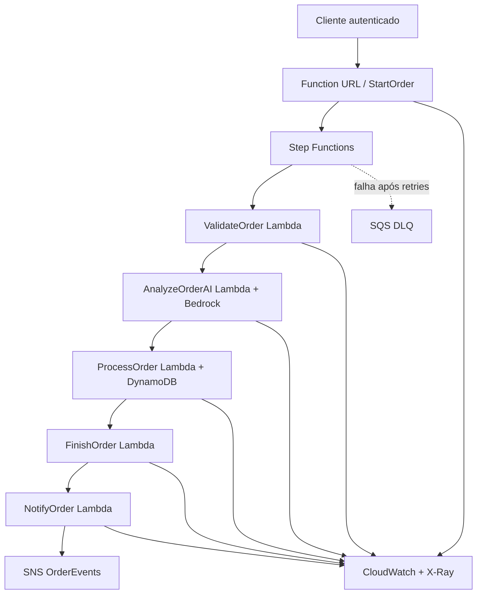

# Projeto Final — Processamento Serverless de Pedidos com IA

Projeto final da pós-graduação em **DevOps & Cloud Platform Engineering com IA — PUC Minas**. A solução consolida os cinco checkpoints em uma arquitetura serverless, orientada a eventos, observável, segura e implantada por CI/CD.

## Resumo da solução

Um pedido entra por uma Lambda Function URL protegida com AWS IAM. A Lambda inicia um workflow do AWS Step Functions, que valida o pedido, solicita ao Amazon Bedrock uma classificação de risco, processa o pedido com idempotência no DynamoDB, finaliza o fluxo e publica o resultado no SNS. Falhas persistentes seguem para uma fila SQS DLQ. Logs, métricas, traces, dashboard e alarme são mantidos no CloudWatch/X-Ray.

> A classificação de IA é um apoio operacional. Ela não aprova nem rejeita pedidos automaticamente.

## Arquitetura



### Fluxo ponta a ponta

1. `start-order` recebe o pedido e inicia uma execução assíncrona.
2. `validate-order` valida `order_id`, `customer` e `amount`.
3. `analyze-order-ai` usa Amazon Bedrock para produzir `risk`, `category` e `reason` em JSON.
4. `process-order` grava o identificador no DynamoDB com condição atômica e impede duplicidades.
5. `finish-order` monta o resultado final preservando a análise da IA.
6. `notify-order` publica o evento `OrderProcessed` no SNS.
7. Qualquer falha não recuperada após retry é preservada na SQS DLQ.

## Evolução dos checkpoints

| Checkpoint | Recurso desenvolvido | Uso no projeto final |
|---|---|---|
| 1 | Lambda HTTP | Entrada do pedido por Function URL |
| 2 | SNS + Lambda | Publicação desacoplada do evento final |
| 3 | Step Functions, DynamoDB e SQS | Workflow, idempotência e DLQ |
| 4 | CloudWatch | Logs JSON, métricas EMF, dashboard e alarme |
| 5 | GitHub Actions | Testes, build e deploy automatizados |
| Final | Amazon Bedrock + AWS SAM | Análise de risco com IA e infraestrutura como código |

## Decisões arquiteturais

### Orquestração no fluxo principal

O Step Functions foi escolhido porque validação, análise por IA, processamento e finalização têm ordem definida. A orquestração centraliza transições, retries e tratamento de falhas, além de tornar cada execução visualmente rastreável.

### Coreografia na saída

O SNS foi escolhido depois da finalização porque os consumidores do evento não precisam participar do fluxo principal. Novos assinantes — e-mail, auditoria, analytics ou faturamento — podem ser adicionados sem alterar as Lambdas de processamento.

### Amazon Bedrock

O Bedrock mantém a integração de IA dentro da AWS e usa IAM em vez de chaves de API no código. O modelo padrão é `amazon.nova-lite-v1:0`, adequado a uma classificação curta e estruturada. A temperatura é zero para reduzir variação, e a resposta é validada antes de seguir.

### Idempotência no DynamoDB

O `put_item` usa `ConditionExpression=attribute_not_exists(order_id)`. Diferentemente de consultar e depois gravar, essa escrita é atômica e evita uma condição de corrida entre requisições simultâneas.

### AWS SAM

O arquivo `template.yaml` cria funções, workflow, tabela, tópico, fila, permissões, endpoint, dashboard e alarme. Não existem ARNs de conta fixos, o que torna o projeto reproduzível em outra conta ou ambiente.

## Segurança

- autenticação da Function URL com `AWS_IAM`;
- autenticação do GitHub Actions por OIDC, sem access key permanente;
- permissões IAM específicas por função;
- criptografia gerenciada no DynamoDB, SNS e SQS;
- nenhum segredo, `.env`, chave ou credencial versionado;
- parâmetros e ARNs obtidos por variáveis de ambiente e CloudFormation;
- rastreamento X-Ray habilitado.

O único secret necessário no GitHub é `AWS_ROLE_ARN`, que contém apenas o ARN da role assumida pelo OIDC. Ele não é uma chave secreta.

## Estrutura

```text
.
├── .github/workflows/deploy.yml
├── lambdas/
│   ├── analyze_order_ai/
│   ├── finish_order/
│   ├── notify_order/
│   ├── process_order/
│   ├── start_order/
│   └── validate_order/
├── observability/observability.py
├── tests/test_lambdas.py
├── workflow/order-processing-workflow.json
├── ROTEIRO_VIDEO.md
├── requirements.txt
└── template.yaml
```

## Pré-requisitos

- Python 3.13;
- AWS CLI autenticado;
- AWS SAM CLI;
- acesso ao modelo Amazon Nova Lite no Bedrock em `us-east-1`;
- role OIDC do GitHub configurada para deploy.

## Testes locais

```bash
python -m venv .venv
source .venv/bin/activate
pip install -r requirements.txt
pytest -v
sam validate --lint
sam build
```

Os testes não chamam a AWS nem o modelo real. A resposta do Bedrock é simulada para validar o contrato e o parsing do JSON.

## Deploy manual inicial

```bash
sam build
sam deploy --guided
```

Valores sugeridos:

- Stack Name: `cloud-serverless-final-project`
- Region: `us-east-1`
- Allow SAM CLI IAM role creation: `Y`
- Save arguments to configuration file: `Y`

Depois do primeiro deploy, os outputs exibem a Function URL, ARN do tópico, ARN do workflow e URL da DLQ.

## CI/CD

Em pull requests, o GitHub Actions executa testes, validação do template e build. Em `push` para `main` ou `master`, após a aprovação dos testes, o pipeline assume a role AWS por OIDC e executa `sam deploy`.

Configuração necessária no repositório:

1. Criar o environment `production` em **Settings > Environments**.
2. Criar o secret `AWS_ROLE_ARN` em **Settings > Secrets and variables > Actions**.
3. A role deve confiar no provedor OIDC `token.actions.githubusercontent.com` e limitar o `sub` a este repositório.

## Exemplo de pedido

```json
{
  "order_id": "ORDER-1001",
  "customer": "Rafaella",
  "amount": 1500.00
}
```

Como a URL usa AWS IAM, a chamada deve ser assinada com Signature Version 4. Para uma demonstração mais simples, também é possível iniciar diretamente o workflow:

```bash
aws stepfunctions start-execution \
  --state-machine-arn "ARN_EXIBIDO_NO_OUTPUT" \
  --input '{"order_id":"ORDER-1001","customer":"Rafaella","amount":1500}'
```

## Observabilidade e evidências

- **Step Functions:** histórico visual de cada etapa e dos retries;
- **CloudWatch Logs:** eventos estruturados em JSON por Lambda;
- **CloudWatch Metrics:** pedidos iniciados, analisados, processados, duplicados e falhas;
- **Dashboard:** `FinalProject-OrderProcessing`;
- **Alarm:** dispara quando existe mensagem visível na DLQ;
- **X-Ray:** rastreamento distribuído das funções e do workflow.

Para a entrega, recomenda-se incluir no README ou na descrição do vídeo capturas de uma execução concluída, dashboard do CloudWatch, resultado dos testes e execução bem-sucedida do GitHub Actions.

## Limitações e próximos passos

- adicionar validação de schema com API Gateway e AWS WAF para exposição pública;
- assinar consumidores reais no tópico SNS;
- criar processo de reprocessamento controlado da DLQ;
- avaliar guardrails do Bedrock e testes de qualidade do prompt;
- definir budgets e alarmes de custo para Bedrock e Step Functions.
